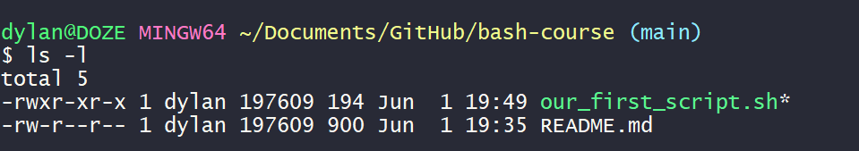

# Section 1 - How to Build a bash script

## Section Goals
- Explain the difference between shells and a script 
- Explain the benefits of using the bash shell
- Explain the benefits of creating scripts

## Section Overview

What is bash? 
- BASH = **B**ourne **A**gain **Sh**ell
- Based on the Bourne Shell (sh), created by Stephen Bourne in 1979
- Most commonly used shell due to several advantages

Why Bash?
- Feature-rich
- Fast
- Very common

Each bash script starts with a hashtag and an exclamation point, better known as **shabang**. Immediately after the hashbang comes the path to the interpreter that is used to read our file.
```bash
#!/usr/bin/bash
```

(Exit Codes)[https://tldp.org/LDP/abs/html/exitcodes.html]:
- 0: everything is good
- 1: error

Giving executable access
`schmod +x our_first_script.sh`
`./our_first_script.sh`

Permissions

```
r: read
w: write
x: execute
-: Cannot do any of the above
```
- typing `ls -l` shows the file permissions
- file permissions are made up of 10 characters.
  - If the first character is **d** the entry is a directory
  - If the first character is **-** the entry is a file
  - The next three characters (2-4) represent the permissions the file owner has for the file. 
  - The next two groups of three (5-7 and 8-10) represent different classes of users on the system. 
  - 5-7 represent the group permissons 
  - 8-10 represent users not in group
- Generally speaking only the file owner should have writing access.

Type in `chmod 744 our_first_script.sh` to give users other than author *only* the ability to read the file. 

[Click here](http://permissions-calculator.org/) to view permission mappings.
Why use a script?
- Scripts Allow For **Automation**

## PATH

- The path variable tells the shell where to search for executable files
- We can add folders to our path by modifying the .profile file
- We can make our scripts accessible system-wide by putting them into a folder covered by our PATH
  - **important note**: try to avoid giving scripts names that will conflict with another command on the system.

## SUMMARY 

